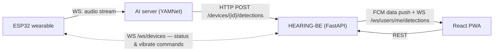

# HEARING-BE

Backend for **Hear:ing** — a sound-awareness assistant for deaf and hard-of-hearing users.

A wearable neckband (ESP32) streams ambient audio to an AI server for classification. This backend
makes the **final alert decision**: it matches each detection against the user's active *mode* and
selected sounds, and on a match it stores the notification, pushes to the web app, and commands the
wearable to vibrate. The AI server only classifies — all judgment lives here.

Capstone project (Duksung Women's University, 2026). Sibling repositories:
[HEARING-FE](https://github.com/2026-DSWU-Hearing/HEARING-FE) (React PWA) ·
[HEARING-MODEL](https://github.com/2026-DSWU-Hearing/HEARING-MODEL) (YAMNet AI server)

## Architecture



Detection flow (a.k.a. *flow A*):

1. AI server posts a classified sound `(category, name, confidence)` for the device.
2. Backend routes the detection to the device's current **active user** (the last account that
   pressed *connect* — nobody means the detection is dropped), resolves the sound by its Korean
   `(category, name)` pair, then checks that user's **active mode** and per-sound on/off toggles.
   Do-not-disturb suppresses everything.
3. On match: save `Notification` → FCM data-only push → in-app WebSocket broadcast → `vibrate`
   command (with the user's haptic strength) to the wearable over its WebSocket.
   No match: silently ignored — nothing is stored.

There is exactly **one physical wearable, so exactly one device row** (MAC from config).
Connectivity is driven **only** by the hardware WebSocket lifecycle: connecting marks that row
`is_connected=true` (and updates `battery_level` from periodic status messages), disconnecting —
or a server restart — marks it `false`; clients cannot write these fields. Who receives alerts is
the row's **active user**: `POST /devices/connect` verifies the hardware is online *right now*
(immediate 409 otherwise — no client-side polling wait) and switches the active user to the
caller, taking over from whoever had it. The device's display name is stored **per account**
(`PATCH /devices/{id}` renames only your view), and `DELETE /devices/{id}` merely releases your
pointer — the hardware socket stays up and notification history always survives. The PWA reads
connection state through plain `GET /devices` polling. WebSocket contracts are documented in
[`docs/websocket.md`](docs/websocket.md).

## Tech stack

FastAPI · SQLAlchemy 2 (async) + asyncpg · PostgreSQL 16 (relational, persistent) ·
Redis 7 (in-memory, ephemeral — guest-login rate limiting, refresh-token revocation) ·
Alembic · python-jose (JWT) · firebase-admin (FCM) · pytest / pytest-asyncio

## Getting started

Prerequisites: Python 3.12, Docker.

```bash
docker compose up -d postgres redis   # PostgreSQL 16 (host port 5433) + Redis 7 (6379)
                                      # 5433: avoids clashing with a natively installed PostgreSQL on 5432

python -m venv .venv
.venv\Scripts\activate             # Windows
pip install -r requirements.txt

copy example.env .env              # then set JWT_SECRET (>= 32 chars), e.g.:
                                   #   python -c "import secrets; print(secrets.token_urlsafe(64))"

python -m app.devinit              # alembic upgrade head + dev user/device seed (prints dev tokens)
python run.py                      # http://localhost:8000 — interactive docs at /docs
```

Optional: place a Firebase service-account key at `firebase-credentials.json` (repo root) to enable
real FCM pushes. Without it, pushes no-op gracefully and everything else works.

## Development

Run everything from the repo root with the venv active.

| Command | What it does |
|---|---|
| `python -m app.devinit` | Bootstrap the dev database (see below). Needs Postgres up. |
| `python run.py` | Run the API server (uvicorn, auto-reload) at http://localhost:8000. |
| `python -m pytest` | Unit + integration tests. **Needs Docker Postgres running** (see *Tests vs. smokes*). |
| `python scripts/smoke_flow_a.py` | End-to-end detection flow (device → mode → matched/unmatched detection → notification filtering). Standalone, no Docker needed. |
| `python scripts/smoke_device_ws.py` | End-to-end hardware WebSocket lifecycle (reject codes 4401/4404, status, vibrate, forced close). Standalone, no Docker needed. |
| `python -m app.devtoken [user_id] [source]` | Print a JWT for manual API calls. `source` = `user` (default) / `device` / `ai-server`. No DB needed. |
| `python scripts/make_device_token.py` | Print the long-lived hardware token for `WS /ws/devices`. |

**What `python -m app.devinit` does** (Postgres must be up): runs `alembic upgrade head`, seeds a dev
user (`id=1`, `dev@hearing.local`) and the single physical device row (`id=1` — the AI server posts
detections with `DEVICE_ID=1`), fixes the Postgres id sequences, and prints ready-to-use
`user` and `ai-server` bearer tokens.

**Tests vs. smokes.** `pytest` runs against **real PostgreSQL** — it creates a throwaway `hearing_test`
database, runs against it, and drops it afterward, so your dev `hearing` DB is never touched. Using
the real engine keeps type / constraint / sequence behaviour identical to production. The two **smoke
scripts** instead use **in-memory SQLite** for a fast check with no Docker; they are standalone (not
collected by `pytest`).

**Why host port 5433?** A natively installed PostgreSQL often already holds `localhost:5432`, so
`docker-compose.yml` maps the container to `5433` to avoid the clash. Keep `DATABASE_URL` on `5433`.

**What Redis is for.** PostgreSQL holds all persistent, relational data; Redis holds only ephemeral
TTL'd state: per-IP guest-login rate-limit counters and the logout blacklist for refresh tokens.
If Redis is down these guards **fail open** — login/refresh/logout keep working, only the protection
is skipped (with a warning log). Redis-dependent tests use keyspace `/15` and skip when Redis is off.

Schema changes: `alembic revision --autogenerate -m "..."` then `alembic upgrade head`.
The sound catalog is reference data seeded by a data migration — change it with a new migration.

`DEV_AUTH_BYPASS=true` in `.env` lets requests through without a token as the dev user.
It is only allowed while `ENVIRONMENT=dev` — with `ENVIRONMENT=prod` the server **refuses to start**
if the bypass is still on (fail-closed guard in `app/core/config.py`).

## Migration history

Migrations are append-only — never rewritten once applied — so the linear chain doubles as a record
of how the schema evolved. A few **add-then-drop pairs** are intentional scope changes, not mistakes:

| # | Revision | Change |
|---|---|---|
| 1 | `5fba0a496e0b` | initial schema |
| 2 | `f1a2b3c4d5e6` | sounds: replace `icon_url` with an `icon` key |
| 3 | `a7b8c9d0e1f2` | add an English `name_key` to sound categories … |
| 4 | `b8c9d0e1f2a3` | … then drop it — the FE settled on the Korean `name` only |
| 5 | `c9d0e1f2a3b4` | drop `risk_level` — unused by hardware, FE, and backend |
| 6 | `d0e1f2a3b4c5` | add `users.push_enabled` |
| 7 | `e1f2a3b4c5d6` | seed the sound catalog (8 categories, 67 sounds) |
| 8 | `f2a3b4c5d6e7` | drop `users.password_hash` — email/password login removed (Google + guest only) |
| 9 | `a3b4c5d6e7f8` | devices: drop the global MAC unique — one physical device shared by every account |
| 10 | `b4c5d6e7f8a9` | notifications.device_id → nullable + ON DELETE SET NULL — history outlives devices |
| 11 | `c5d6e7f8a9b0` | `users.push_enabled` defaults to false for new users |
| 12 | `d6e7f8a9b0c1` | devices → **single physical row** + `active_user_id`; per-account device name moves to `users.device_nickname` |

Steps **3→4** are the clearest case: an English category key was introduced for the API, then
abandoned when the FE committed to Korean labels. `risk_level` (5) and `password_hash` (8) were
likewise dropped as those features left scope. Steps **9→12** record the device model converging:
per-account rows sharing one MAC (9) turned out to replicate connection state N times, so the
schema settled on a single physical row with one active user (12). Revision IDs are hash-style by
convention.

## API surface

All REST routes are unprefixed; see `/docs` for full request/response schemas.

| Area | Routes | Notes |
|---|---|---|
| Auth | `POST /auth/google`, `/auth/guest`, `/auth/refresh`, `/auth/logout` | Google Identity Services id_token, or a one-click sandbox guest account |
| Users | `GET/PATCH /users/me` + `haptic`, `do-not-disturb`, `push-enabled`, `fcm-token`, `agreement` | per-user alert preferences |
| Modes | `GET/POST/PUT/DELETE /modes`, `PATCH /modes/{id}/activate`, `PUT /modes/{id}/sounds`, `PATCH /modes/{id}/sounds/{sid}` | sound-filter presets (max 6, one active); per-sound on/off |
| Sounds | `GET /sounds`, `GET /sounds/categories` | fixed catalog; Korean labels are part of the FE contract |
| Devices | `GET /devices`, `POST /devices/connect`, `PATCH/DELETE /devices/{id}`, `POST /devices/{id}/detections` | connect = instant hardware check + active-user switch; detections endpoint is called by the AI server / wearable |
| Notifications | `GET /notifications`, `PATCH /{id}/read`, `DELETE /{id}` | detection history |
| WebSocket | `WS /ws/users/me/detections`, `WS /ws/devices` | in-app alerts / hardware channel — see [`docs/websocket.md`](docs/websocket.md) |

## Project layout

```
app/
  api/          # routers — thin: auth deps, validation, serialization
  services/     # business logic (mode matching, detection flow, push)
  models/       # SQLAlchemy models
  schemas/      # pydantic request/response contracts (FE-shaped)
  websocket/    # connection managers + user/device socket handlers
  core/         # config, JWT, exceptions, logging, middleware
  db/           # session factory, shared query helpers
alembic/        # migrations (schema + seeded sound catalog)
scripts/        # standalone smoke tests, device-token minting
tests/          # pytest unit tests
```

## Trust model & deployment notes

Known, deliberate limitations for the capstone scope — revisit before any public deployment:

- `POST /devices/{id}/detections` trusts any `device`/`ai-server` token for any device id
  (no per-device binding). Fine inside the team's demo topology.
- The hardware token is long-lived and only revocable by rotating `JWT_SECRET`.
- `POST /auth/guest` creates a sandbox user per call — rate-limited per IP (Redis, default 10/h);
  the limit fails open if Redis is down.
- `POST /auth/logout` revokes the refresh token via a Redis blacklist (TTL = remaining lifetime);
  access tokens stay valid until they expire (max 60 min).
- Deploy checklist: `ENVIRONMENT=prod` (boot fails if `DEV_AUTH_BYPASS` is still on) ·
  strong `JWT_SECRET` · real `GOOGLE_CLIENT_ID` · production CORS origins.
