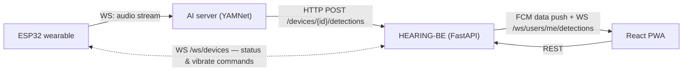

# HEARING-BE

Backend for **Hear:ing** — a sound-awareness assistant for deaf and hard-of-hearing users.

A wearable neckband (ESP32) streams ambient audio to an AI server for classification. This backend
makes the **final alert decision**: it matches each detection against the user's active *mode* and
selected sounds, and on a match it stores the notification, pushes to the web app, and commands the
wearable to vibrate. The AI server only classifies — all judgment lives here.

Capstone project (Duksung Women's University, 2026). Sibling repositories:
[HEARING-FE](https://github.com/2026-DSWU-Hearing/HEARING-FE) (React PWA) ·
[HEARING-MODEL](https://github.com/2026-DSWU-Hearing/HEARING-MODEL) (YAMNet AI server)

## Architecture



Detection flow (a.k.a. *flow A*):

1. AI server posts a classified sound `(category, name, confidence)` for a device.
2. Backend resolves the sound by its Korean `(category, name)` pair, then checks the owning user's
   **active mode** and the per-sound on/off toggles. Do-not-disturb suppresses everything.
3. On match: save `Notification` → FCM data-only push → in-app WebSocket broadcast → `vibrate`
   command (with the user's haptic strength) to the wearable over its WebSocket.
   No match: silently ignored — nothing is stored.

Device connectivity is driven by the hardware WebSocket lifecycle: connecting marks the device
`is_connected=true` (and updates `battery_level` from periodic status messages), disconnecting marks
it `false`. The PWA reads this through plain `GET /devices` polling. WebSocket contracts are
documented in [`docs/websocket.md`](docs/websocket.md).

## Tech stack

FastAPI · SQLAlchemy 2 (async) + asyncpg · PostgreSQL 16 · Alembic · python-jose (JWT) ·
firebase-admin (FCM) · pytest / pytest-asyncio

## Getting started

Prerequisites: Python 3.12, Docker.

```bash
docker compose up -d postgres      # PostgreSQL 16 on host port 5433
                                   # (5433 avoids clashing with a natively installed PostgreSQL on 5432)

python -m venv .venv
.venv\Scripts\activate             # Windows
pip install -r requirements.txt

copy example.env .env              # then set JWT_SECRET (>= 32 chars), e.g.:
                                   #   python -c "import secrets; print(secrets.token_urlsafe(64))"

python -m app.devinit              # alembic upgrade head + dev user/device seed (prints dev tokens)
python run.py                      # http://localhost:8000 — interactive docs at /docs
```

Optional: place a Firebase service-account key at `firebase-credentials.json` (repo root) to enable
real FCM pushes. Without it, pushes no-op gracefully and everything else works.

## Development

| Command | Purpose |
|---|---|
| `python -m pytest` | unit tests |
| `python scripts/smoke_flow_a.py` | end-to-end detection flow — in-memory SQLite, no Postgres needed |
| `python scripts/smoke_device_ws.py` | end-to-end hardware WebSocket lifecycle (reject codes, status, vibrate, forced close) |
| `python -m app.devtoken [user_id] [source]` | mint a dev JWT (`user` / `device` / `ai-server`) |
| `python scripts/make_device_token.py` | mint the long-lived hardware token for `WS /ws/devices` |

Schema changes: `alembic revision --autogenerate -m "..."` then `alembic upgrade head`.
The sound catalog is reference data seeded by a data migration — change it with a new migration.

`DEV_AUTH_BYPASS=true` in `.env` lets requests through without a token as the dev user.
It is only allowed while `ENVIRONMENT=dev` — with `ENVIRONMENT=prod` the server **refuses to start**
if the bypass is still on (fail-closed guard in `app/core/config.py`).

## API surface

All REST routes are unprefixed; see `/docs` for full request/response schemas.

| Area | Routes | Notes |
|---|---|---|
| Auth | `POST /auth/google`, `/auth/guest`, `/auth/refresh`, `/auth/logout` | Google Identity Services id_token, or a one-click sandbox guest account |
| Users | `GET/PATCH /users/me` + `haptic`, `do-not-disturb`, `push-enabled`, `fcm-token`, `agreement` | per-user alert preferences |
| Modes | `GET/POST/PUT/DELETE /modes`, `PATCH /modes/{id}/activate`, `PUT /modes/{id}/sounds`, `PATCH /modes/{id}/sounds/{sid}` | sound-filter presets (max 6, one active); per-sound on/off |
| Sounds | `GET /sounds`, `GET /sounds/categories` | fixed catalog; Korean labels are part of the FE contract |
| Devices | `GET/POST/PATCH/DELETE /devices`, `POST /devices/{id}/detections` | detections endpoint is called by the AI server / wearable |
| Notifications | `GET /notifications`, `PATCH /{id}/read`, `DELETE /{id}` | detection history |
| WebSocket | `WS /ws/users/me/detections`, `WS /ws/devices` | in-app alerts / hardware channel — see [`docs/websocket.md`](docs/websocket.md) |

## Project layout

```
app/
  api/          # routers — thin: auth deps, validation, serialization
  services/     # business logic (mode matching, detection flow, push)
  models/       # SQLAlchemy models
  schemas/      # pydantic request/response contracts (FE-shaped)
  websocket/    # connection managers + user/device socket handlers
  core/         # config, JWT, exceptions, logging, middleware
  db/           # session factory, shared query helpers
alembic/        # migrations (schema + seeded sound catalog)
scripts/        # standalone smoke tests, device-token minting
tests/          # pytest unit tests
```

## Trust model & deployment notes

Known, deliberate limitations for the capstone scope — revisit before any public deployment:

- `POST /devices/{id}/detections` trusts any `device`/`ai-server` token for any device id
  (no per-device binding). Fine inside the team's demo topology.
- The hardware token is long-lived and only revocable by rotating `JWT_SECRET`.
- `POST /auth/guest` creates a sandbox user per call and is not rate-limited yet.
- Deploy checklist: `ENVIRONMENT=prod` (boot fails if `DEV_AUTH_BYPASS` is still on) ·
  strong `JWT_SECRET` · real `GOOGLE_CLIENT_ID` · production CORS origins.
